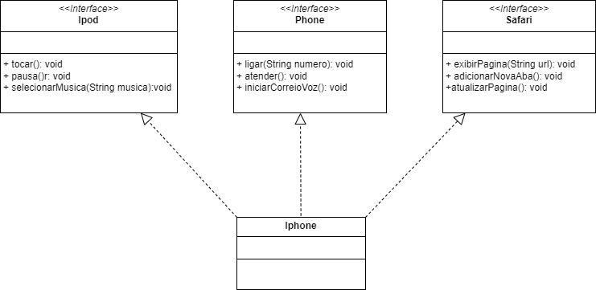

# Desafio de POO - Interface do Iphone :iphone:

Neste desafio, criei o diagrama de classe 'Iphone' para poder
implementar as interfaces e classes necessárias para criação
do projeto java proposto.

Em seguida criei o projeto no eclipse para executar as funcionalidades
e integrar os recursos de som, ligação e navegação na web
junto com o smartphone.

